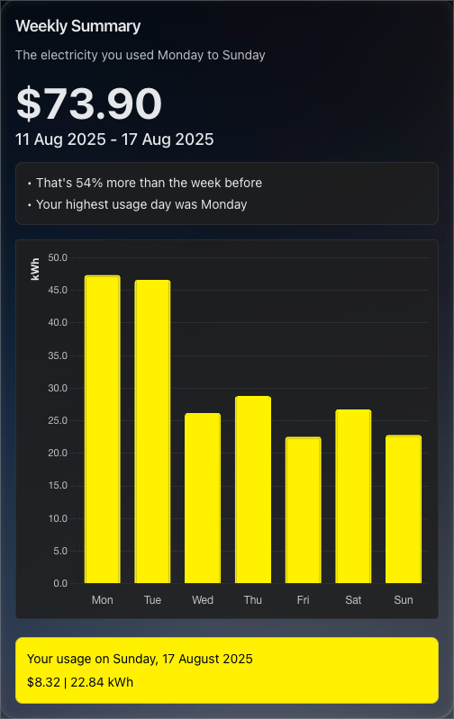
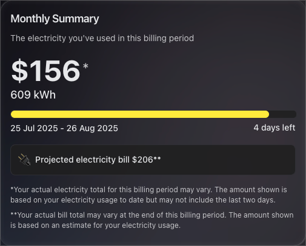

# Mercury Energy NZ - Home Assistant Integration

A custom Home Assistant integration that provides beautiful, interactive energy usage charts for Mercury Energy New Zealand customers.

## Demo

### Energy Usage

```yaml
type: custom:mercury-energy-usage-card
entity: sensor.mercury_nz_energy_usage
name: Energy Usage Charts
```


### Energy Weekly Summary

```yaml
type: custom:mercury-energy-weekly-summary-card
entity: sensor.mercury_nz_energy_usage
name: Weekly Summary
```



### Energy Monthly Summary

```yaml
type: custom:mercury-energy-monthly-summary-card
entity: sensor.mercury_nz_current_period_cost
name: Monthly Summary
```



## ✨ Features

### 📊 Interactive Chart Card

- **Beautiful Chart.js Visualization**: Modern, responsive energy usage charts
- **Dual Data Display**: Shows both energy usage (kWh) and temperature data
- **Smart Pagination**: Navigate through historical data with intelligent 12-day pagination
- **Custom Styling**:
  - Bright yellow energy bars with rounded top corners
  - Custom temperature line color
  - Tooltip positioning above data points
- **Period Selection**: Toggle between Hourly, Daily, and Monthly views (Daily default)

### 📅 Monthly Summary Card

- **Billing Period Overview**: Current usage cost and consumption for the billing period
- **Progress Tracking**: Visual progress bar showing billing period completion
- **Date Information**: Billing period start/end dates and days remaining
- **Projected Billing**: Automatically extracts projected bill amounts from Mercury's notes
- **Responsive Design**: Adapts to different screen sizes and themes

### 🎨 Visual Features

- **Custom Colors**: Bright yellow (#FFF000) energy bars, custom temperature line
- **Responsive Design**: Adapts to different screen sizes and Home Assistant themes
- **Hidden Legend**: Clean interface without cluttering labels
- **Navigation Controls**: Previous/Next buttons with smart visibility
- **Date Labels**: Dynamic date display showing current page range

### 🔧 Smart Pagination

- **12-Day Default**: Shows 12 days of data per page for optimal viewing
- **Intelligent Navigation**: Automatically hides navigation buttons when no additional data available
- **Smart Date Ranges**: When limited data available, shows shifted date ranges for meaningful navigation
- **Tooltip Management**: Automatically hides tooltips during navigation

## 🚀 Installation

### Option 1: HACS (Recommended)

1. **Add Custom Repository**:

   - Go to HACS → Integrations
   - Click the three dots (⋮) → Custom repositories
   - Add repository URL: `https://github.com/bkintanar/home-assistant-mercury-co-nz`
   - Category: Integration

2. **Install Integration**:
   - Search for "Mercury Energy NZ" in HACS
   - Click Install
   - Restart Home Assistant

### Option 2: Manual Installation

1. **Copy Files**:

   ```bash
   # Download and extract to your Home Assistant config directory
   mkdir -p /config/custom_components/mercury_co_nz/
   # Copy all files from custom_components/mercury_co_nz/
   ```

2. **Restart Home Assistant**

## ⚙️ Configuration

### 1. Add Integration

- Go to Configuration → Integrations
- Click "Add Integration"
- Search for "Mercury Energy NZ"
- Enter your Mercury Energy credentials

### 2. Add Chart Card

Add this to your Home Assistant dashboard:

```yaml
type: custom:mercury-energy-usage-card
entity: sensor.mercury_nz_energy_usage
name: Energy Usage Charts
```

### Configuration Options

| Option            | Type    | Default                  | Description                           |
| ----------------- | ------- | ------------------------ | ------------------------------------- |
| `entity`          | string  | **required**             | The Mercury Energy sensor entity      |
| `name`            | string  | "Energy Usage"           | Card title                            |
| `show_navigation` | boolean | `false`                  | Show previous/next navigation         |
| `period`          | string  | `hourly\|daily\|monthly` | Time periods to show (pipe-separated) |

## 📋 Requirements

- Home Assistant 2023.1 or newer
- Mercury Energy New Zealand account
- Active internet connection for data retrieval

## 🐳 Docker Deployment

For Docker-based Home Assistant installations:

```bash
# Copy files to container
docker cp custom_components/mercury_co_nz/ homeassistant:/config/custom_components/

# Restart container
docker restart homeassistant
```

## 🎯 Usage Examples

### Basic Card

```yaml
type: custom:mercury-energy-usage-card
entity: sensor.mercury_nz_energy_usage
name: Daily Usage
```

> **Note**: For charting, use one of these sensors with full historical data:
>
> - `sensor.mercury_nz_energy_usage` (recommended)
> - `sensor.mercury_nz_total_usage_7_days`
> - `sensor.mercury_nz_current_bill_7_days`
>
> Other sensors (billing info, dates, etc.) have minimal attributes to optimize database performance.

### Advanced Card with Navigation

```yaml
type: custom:mercury-energy-usage-card
entity: sensor.mercury_nz_energy_usage
name: Energy Usage Charts
```

### Period Filtering Examples

Show only daily and monthly views:

```yaml
type: custom:mercury-energy-usage-card
entity: sensor.mercury_nz_energy_usage
name: Energy Usage Charts
period: daily|monthly
```

Show only hourly view:

```yaml
type: custom:mercury-energy-usage-card
entity: sensor.mercury_nz_energy_usage
name: Hourly Usage
period: hourly
```

Show all periods (default):

```yaml
type: custom:mercury-energy-usage-card
entity: sensor.mercury_nz_energy_usage
name: Energy Usage Charts
period: hourly|daily|monthly
```

### Monthly Summary Card

```yaml
type: custom:mercury-monthly-summary-card
entity: sensor.mercury_nz_current_period_cost
name: Monthly Summary
show_progress_bar: true
```

#### Monthly Summary Configuration

| Option              | Type    | Default           | Description                      |
| ------------------- | ------- | ----------------- | -------------------------------- |
| `entity`            | string  | **Required**      | Any Mercury NZ sensor entity     |
| `name`              | string  | "Monthly Summary" | Card title                       |
| `show_progress_bar` | boolean | true              | Show billing period progress bar |

The monthly summary card displays:

- **Current usage cost and consumption** for the billing period
- **Billing period dates** (start and end)
- **Days remaining** in the current billing period
- **Progress bar** showing how much of the billing period has elapsed
- **Projected bill amount** extracted from Mercury's billing notes

## 🛠️ Development

### Setting Up Development Environment

```bash
# Clone repository
git clone https://github.com/bkintanar/home-assistant-mercury-co-nz.git
cd home-assistant-mercury-co-nz

# Install dependencies
pip install -r requirements_dev.txt
```

### Deployment Script

Use the included deployment script for easy testing:

```bash
./deploy.sh
```

This script:

- Detects Docker vs direct installation
- Copies files to appropriate locations
- Provides configuration examples

### File Structure

```
custom_components/mercury_co_nz/
├── __init__.py              # Integration setup
├── config_flow.py           # Configuration flow
├── const.py                 # Constants
├── coordinator.py           # Data coordinator
├── custom-chart-card.js     # Frontend chart card
├── manifest.json            # Integration manifest
├── mercury_api.py           # Mercury Energy API client
├── sensor.py                # Sensor entities
└── strings.json             # Translation strings
```

## 🔧 Features Implemented

### Chart Customizations

- ✅ Removed usage legend
- ✅ Bright yellow (#FFF000) bar colors
- ✅ Custom temperature line color (#69A2B9)
- ✅ Rounded top corners on bars
- ✅ Tooltip positioning above data points
- ✅ Hidden page numbers in navigation

### Smart Pagination

- ✅ 12-day default pagination
- ✅ Smart navigation button visibility
- ✅ Tooltip hiding during navigation
- ✅ Date label updates for current page
- ✅ Intelligent date range shifting for limited data

### User Interface

- ✅ Hourly/Daily/Monthly period buttons
- ✅ Clean navigation controls
- ✅ Responsive design
- ✅ Theme integration

## 🐛 Troubleshooting

### Chart Not Loading

1. Check browser console for JavaScript errors
2. Verify entity exists and has data
3. Hard refresh browser (Ctrl+F5 / Cmd+Shift+R)

### Navigation Not Working

1. Ensure ` in configuration
2. Verify sufficient historical data exists
3. Check Home Assistant logs for errors

### Data Not Updating

1. Check Mercury Energy API credentials
2. Verify internet connectivity
3. Restart Home Assistant integration

## 📜 License

This project is licensed under the MIT License - see the [LICENSE](LICENSE) file for details.

## 🤝 Contributing

1. Fork the repository
2. Create a feature branch
3. Make your changes
4. Add tests if applicable
5. Submit a pull request

## 🙏 Acknowledgments

- Mercury Energy New Zealand for providing API access
- Home Assistant community for integration framework
- Chart.js for the excellent charting library

## 📞 Support

- **Issues**: [GitHub Issues](https://github.com/bkintanar/home-assistant-mercury-co-nz/issues)
- **Discussions**: [GitHub Discussions](https://github.com/bkintanar/home-assistant-mercury-co-nz/discussions)
- **Home Assistant Community**: [Community Forum](https://community.home-assistant.io/)

---

**Note**: This integration is not officially affiliated with Mercury Energy New Zealand. Use at your own discretion and ensure compliance with Mercury Energy's terms of service.
